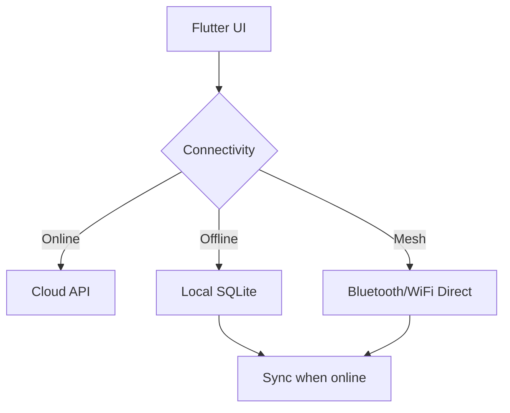

# Mobile App Integration Plan

This document outlines a high-level strategy for developing iOS and Android
applications that interface with the AGI-EGGS framework.

## Goals
- Provide a simple interface for reporting emergencies and receiving alerts.
- Operate in offline or low-bandwidth environments with mesh relays.
- Support progressive capabilities depending on device resources.

## Architecture Overview
The mobile apps will use Flutter for cross-platform UI with native modules for
WiFi Direct (Android) and MultipeerConnectivity (iOS). Data is stored locally in
SQLite and synced when connectivity is available.

## Current Status
This document serves as a starting point. Implementation work remains to create
the Flutter project and integrate networking libraries.
